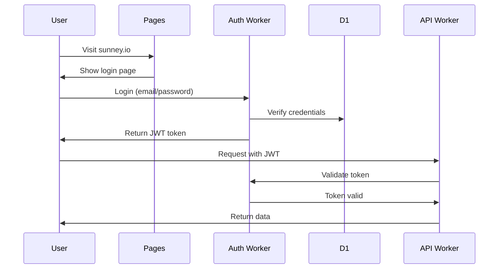

# Sunney.io Platform Architecture
## First Principles Design for Scale & Functionality

## 🎯 Core Principles

1. **Authentication First** - Every user must authenticate
2. **Single Source of Truth** - One data pipeline, one storage strategy
3. **API-Driven** - All apps consume via API, no direct DB access
4. **Edge-Native** - Built for Cloudflare's global network
5. **GitOps** - GitHub is the source, Cloudflare is the runtime

## 🏗️ Architecture Overview

```
┌─────────────────────────────────────────────────────────────┐
│                         USERS                                │
│                    (Must Authenticate)                       │
└────────────────────────┬────────────────────────────────────┘
                         │
                         ▼
┌─────────────────────────────────────────────────────────────┐
│                   CLOUDFLARE PAGES                           │
│                   (sunney.io domain)                         │
│  ┌──────────────────────────────────────────────────────┐   │
│  │  Static Assets (HTML/JS/CSS)                         │   │
│  │  - Dashboards (nem-live, refined, full)              │   │
│  │  - Apps (trading, BESS, forward-lite)                │   │
│  │  - Authentication UI                                 │   │
│  └──────────────────────────────────────────────────────┘   │
└────────────────────────┬────────────────────────────────────┘
                         │ API Calls
                         ▼
┌─────────────────────────────────────────────────────────────┐
│              WORKER 1: sunney-auth                           │
│                 (Authentication Gateway)                     │
│  - JWT token generation/validation                          │
│  - User management (D1: users database)                     │
│  - Session management (KV: sessions)                        │
│  - Rate limiting per user                                   │
└────────────────────────┬────────────────────────────────────┘
                         │ Authenticated requests only
                         ▼
┌─────────────────────────────────────────────────────────────┐
│              WORKER 2: sunney-api                            │
│                    (API Gateway)                             │
│  Routes:                                                     │
│  - /api/prices/* → Live market data                        │
│  - /api/forward/* → Forward curves                         │
│  - /api/fcas/* → FCAS data                                │
│  - /api/trading/* → Trading game state                     │
│  - /api/bess/* → BESS optimization                         │
│  - /api/demand/* → Demand forecasts                        │
└────────────────────────┬────────────────────────────────────┘
                         │ Reads from
                         ▼
┌─────────────────────────────────────────────────────────────┐
│                    DATA LAYER                                │
│  ┌────────────────────────────────────────────────────┐     │
│  │ KV: sunney-cache (Hot data, <1min old)             │     │
│  │ - prices:latest                                    │     │
│  │ - fcas:latest                                      │     │
│  │ - demand:latest                                    │     │
│  └────────────────────────────────────────────────────┘     │
│  ┌────────────────────────────────────────────────────┐     │
│  │ D1: sunney-market (Time-series data)               │     │
│  │ - dispatch_prices                                  │     │
│  │ - forward_prices                                   │     │
│  │ - fcas_prices                                      │     │
│  │ - trading_positions                                │     │
│  └────────────────────────────────────────────────────┘     │
│  ┌────────────────────────────────────────────────────┐     │
│  │ R2: sunney-archive (Raw files & backups)           │     │
│  │ - /raw/2024/08/23/*.zip                           │     │
│  │ - /aurora/*.json                                   │     │
│  └────────────────────────────────────────────────────┘     │
└────────────────────────┬────────────────────────────────────┘
                         │ Populated by
                         ▼
┌─────────────────────────────────────────────────────────────┐
│              WORKER 3: sunney-scraper                        │
│                  (Data Collection)                           │
│  - Runs every 5 minutes (cron trigger)                      │
│  - Fetches from nemweb.com.au                              │
│  - Parses CSV/ZIP files                                    │
│  - Stores in D1, updates KV cache                          │
│  - No external API access                                  │
└─────────────────────────────────────────────────────────────┘
```

## 🔐 Authentication Flow



## 💾 Storage Strategy

### KV Namespace (sunney-cache)
- **Purpose**: Ultra-fast reads for live data
- **TTL**: 60 seconds
- **Keys**:
  - `prices:latest` - Current prices all regions
  - `prices:NSW1` - Region-specific cache
  - `user:{id}:session` - User sessions

### D1 Database (sunney-market)
- **Purpose**: Queryable time-series data
- **Tables**:
  - `users` - User accounts
  - `dispatch_prices` - 5-min market prices
  - `forward_prices` - Aurora forward curves
  - `fcas_prices` - Ancillary services
  - `trading_positions` - Game positions
  - `api_keys` - API access management

### R2 Bucket (sunney-archive)
- **Purpose**: Raw data archive, backups
- **Structure**:
  ```
  /raw/YYYY/MM/DD/dispatch_HH_MM.zip
  /aurora/region_date.json
  /exports/daily_backup_YYYY_MM_DD.sql
  ```

## 🚀 Why This Architecture?

### Why 3 Workers?

1. **sunney-auth** (Authentication)
   - Dedicated security layer
   - Isolated from business logic
   - Can be updated without affecting data

2. **sunney-api** (API Gateway)
   - All business logic in one place
   - Easy to add new endpoints
   - Single point for monitoring

3. **sunney-scraper** (Background Job)
   - Runs independently
   - Won't affect user requests
   - Can retry failures

### Why Not More Workers?
- More workers = more complexity
- These 3 cover all use cases
- Can scale each independently

### Why Not Fewer Workers?
- Auth needs isolation (security)
- Scraper needs cron (background)
- API needs HTTP (user-facing)

## 📦 Deployment Strategy

### GitHub → Cloudflare (Recommended)

```yaml
# GitHub Actions deploys to Cloudflare
on:
  push:
    branches: [main]
    
jobs:
  deploy:
    - Deploy Workers via Wrangler Action
    - Deploy Pages via Pages Action
```

**Benefits**:
- Version control
- Rollback capability
- PR reviews
- Automated testing
- Single source of truth

### Direct Cloudflare Deploy (Not Recommended)
- Loses version history
- No rollback
- No code review
- Harder to collaborate

## 🔄 Data Flow

1. **Scraper** fetches from NEMWEB every 5 minutes
2. **Scraper** stores in D1, updates KV cache
3. **API** reads from KV (fast) or D1 (fallback)
4. **Pages** calls API with user token
5. **Auth** validates every request

## 🎯 Scaling Strategy

### Phase 1: Launch (Current)
- 3 Workers
- 1 D1 database
- 1 KV namespace
- 1 R2 bucket

### Phase 2: Growth (100+ users)
- Add Durable Objects for real-time features
- Implement WebSocket for live updates
- Add caching headers

### Phase 3: Scale (1000+ users)
- Split API into microservices
- Add read replicas
- Implement GraphQL gateway
- Add CDN for static assets

## 🔧 Technology Choices

- **Framework**: Hono (lightweight, fast)
- **Auth**: JWT with refresh tokens
- **Database**: D1 (SQL at the edge)
- **Cache**: KV (millisecond reads)
- **Storage**: R2 (S3-compatible)
- **Language**: TypeScript
- **Deploy**: GitHub Actions
- **Monitoring**: Cloudflare Analytics

## 📊 Cost Optimization

Estimated monthly costs:
- Workers: $5 (Bundled plan)
- D1: Included
- KV: Included
- R2: ~$5 (100GB)
- Pages: Free
- **Total**: ~$10/month

## 🚨 Security Considerations

1. **Authentication Required** - No public data
2. **JWT Tokens** - Expire after 24 hours
3. **Rate Limiting** - Per user, per endpoint
4. **CORS** - Only allow sunney.io origin
5. **Input Validation** - Zod schemas
6. **SQL Injection** - Prepared statements
7. **Secrets** - Environment variables

## 📈 Monitoring & Observability

- **Metrics**: Cloudflare Analytics
- **Logs**: Wrangler tail
- **Errors**: Sentry integration
- **Uptime**: Better Uptime
- **Performance**: Web Vitals

## 🎓 Why This is Better Than Current Setup

| Aspect | Current (LeTool) | New (Sunney.io) |
|--------|-----------------|-----------------|
| Workers | 5+ different | 3 purposeful |
| Auth | None | JWT-based |
| Deploy | Manual | GitHub Actions |
| Storage | Mixed | Unified strategy |
| API | Multiple endpoints | Single gateway |
| Cost | Unknown | Predictable |
| Scale | Limited | Designed for growth |

This architecture is built for **reliability**, **security**, and **scale** from day one.